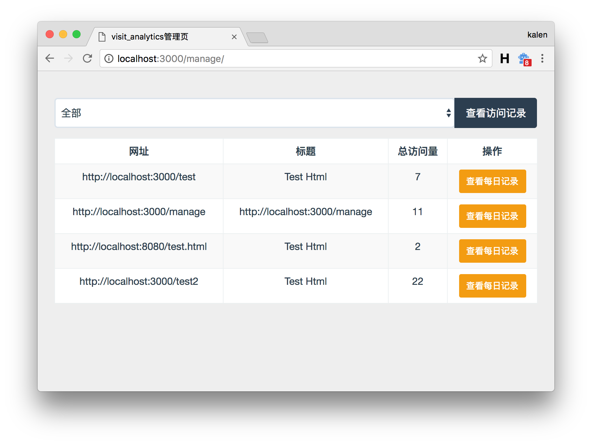
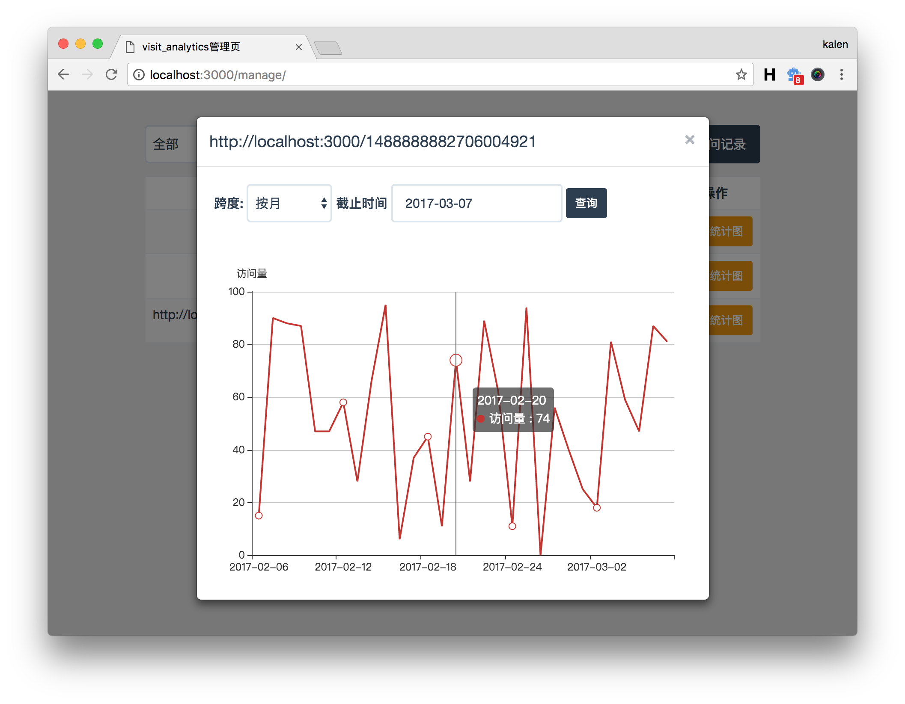

# visit_analytics
自用的网站访问量统计工具

## STATUS
正在测试中...

## 截图
### 总访问量

### 显示日(月)访问量


## 使用
### 下载安装
``` sh
git clone https://github.com/nladuo/visit_analytics.git
cd visit_analytics
make prepare 		# 下载库文件
```

### 创建数据库
``` sql
CREATE DATABASE IF NOT EXISTS `visit_analytics` DEFAULT CHARSET utf8 COLLATE utf8_general_ci;
```

### 配置文件
打开config,yaml, 配置mysql与访问密码。
``` yaml
manage:
  username: nladuo
  password: nladuo
db:
  username: root
  password: root
  port: 3306
  host: localhost
  dbname: visit_analytics
deploy_host: localhost:3000
```

### 安装运行
``` sh
make && ./visit_analytics
```

## 使用
添加`<script type="text/javascript" src="http://localhost:3000/analytics.js"></script>`到要统计的网页中,(将localhost替换成你部署的服务器host)。

## LICENSE
MIT
